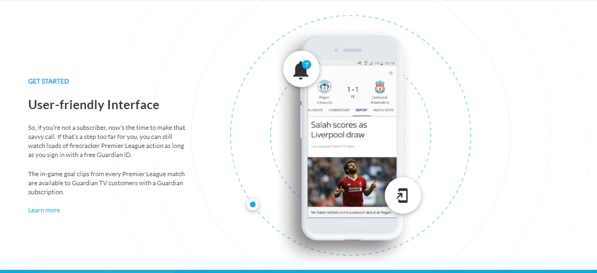

# Front-end assessment

A mockup-to-website example to be used as an assessment
<h1 align="center">Sports App</h1>

<div align="center">
  <h3>
    <a href="https://sports-app-rinon.netlify.app/"
      Demo
    </a>
    <span> | </span>
    <a href="https://github.com/ganamavo/front-end-assessment">
      Solution
    </a>
  </h3>
</div>

<!-- TABLE OF CONTENTS -->

## Table of Contents

-   [Overview](#overview)
    -   [Built With](#built-with)
-   [Features](#features)
-   [How to use](#how-to-use)
-   [Contact](#contact)
-   [Acknowledgements](#acknowledgements)

<!-- OVERVIEW -->

## Overview



1.  My demo can be seen by following this [link](https://sports-app-rinon.netlify.app/)
1.  Some experience:
  - Building an existing website called sports App. This is actually the homepage without any menu in the header. Working on multiple backgrounds and adjusting their sizes to the container is the most important skill that I get out of this project.

1.   What I have learned and improved:
  - Learning how to use fonts faces, working on multiple backgrounds and adjusting their sizes to their container.

1. Wisdom to share:
The best way to improve is to be motivated and always confident to face challenges no matter how difficult it will be.

### Built With

- [Sass](http://www.mailplanet.com/@sass.com)
- [HTML] (https://html.com/)

## How To Use

To clone and run this application, you'll need [Git](https://git-scm.com) and [Node-sass](https://docs.npmjs.com/cli/v6/commands/npm-install)) installed on your computer. From your command line:

```bash
# Clone this repository
$ git clone https://github.com/ganamavo/front-end-assessment

### Install
 - `npm i`
### Running  css
 - `npm run css:watch`

